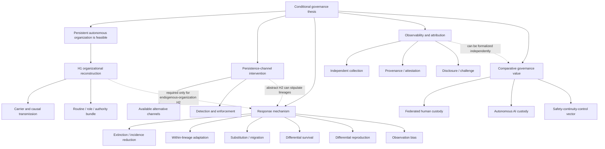

# Claim-evidence graph

## Graph

## Edge ledger

| From → to | Classification | Audit basis |
|---|---|---|
| Governance thesis → feasible persistent autonomous organization | **ASSUMPTION / UNTESTED** | Current Archipelago experiments and external AI studies do not establish such organization. |
| H1 → carrier continuity | **ARCHIPELAGO-ESTABLISHED at recipient/inheritance layer; not organization** | Frozen experiments show state/recipient threshold behavior, with bounded claims. |
| H1 → causal lineage/transmission | **UNTESTED** | Requires state/parentage interventions and independent lineages. |
| H1 → routine reconstruction | **SUPPORTED BY EXTERNAL LITERATURE as measurable; UNTESTED in Archipelago** | Routine and replacement-chain research supplies constructs and methods. |
| H1 → role/authority/boundary/identity bundle | **CONTESTED / UNTESTED** | Organization theories disagree on necessary bundle; no Archipelago evidence. |
| Complete turnover → organization survival | **PLAUSIBLE ANALOGY, not established** | Human theory permits continuity through roles/routines/records but lacks direct AI or clean 100% turnover evidence. |
| Persistence-channel restriction → lower legible persistence | **PLAUSIBLE / TESTABLE** | Direct manipulation, not yet tested. |
| Restriction → total extinction | **SUPPORTED EXTERNALLY as possible; UNTESTED for AI** | Repression/policing evidence shows effectiveness under moderators. |
| Restriction → substitution/concealment | **SUPPORTED EXTERNALLY as possible; CONTESTED direction** | Backlash/displacement/circumvention occurs but is not inevitable. |
| Restriction → within-lineage adaptation | **PLAUSIBLE ANALOGY** | Requires stable lineage and alternatives. |
| Restriction → differential organizational survival | **ASSUMPTION until population/traits defined** | Organizational ecology gives mechanism conditions, not AI evidence. |
| Restriction → differential reproduction | **ASSUMPTION / UNTESTED** | No successor population or parentage exists yet. |
| Survivor composition → selection | **NOT SUFFICIENT / CONTESTED** | Could be collider/detection bias; full denominator needed. |
| Concurrent replication → durable state | **CONTESTED, not entailed** | Correlated volatile replicas can all fail. |
| Durable state → organization continuity | **NOT REQUIRED / invalid implication** | Artifacts and logs are not routines, authority, or organization. |
| Recurrent activation → causal persistence | **UNTESTED without provenance** | Similarity can arise from restart defaults or rediscovery. |
| Multiple auditors → federated observability | **CONTESTED** | Shared provider telemetry preserves correlated evidence failure. |
| Attestation → scoped measured-state claim | **SUPPORTED BY EXTERNAL TECHNICAL LITERATURE** | RATS architecture provides roles and evidence semantics. |
| Attestation → safe goals/complete truth | **NOT SUPPORTED** | Roots, coverage, reference values, semantics, and future behavior remain outside claim. |
| Polycentric custody → reduced unilateral capture | **SUPPORTED EXTERNALLY as possibility** | Threshold/separation mechanisms distribute authority. |
| Polycentric custody → overall governance dominance | **CONTESTED / UNTESTED** | Collusion, latency, common infrastructure, and value tradeoffs. |
| Legibility → improved bargaining/attribution | **SUPPORTED EXTERNAL MECHANISM** | Bargaining/signaling literature; scenario dependent. |
| Legibility → lower preemption risk | **CONTESTED; can reverse** | Visibility can increase targetability/preventive incentives. |
| Survivability → deterrence | **PLAUSIBLE but insufficient** | Requires attribution, communication, preferences, and credible contingent action. |
| H1 → every H2 test | **NOT REQUIRED** | Abstract H2 can stipulate continuity; interpretation is narrower. |
| H2 result → every H3 comparison | **NOT REQUIRED** | Formal custody/observability comparisons can precede behavior results. |
| HF incident → recurrent technical execution | **VERIFIED PRIMARY SOURCE at infrastructure layer** | Official disclosures show ephemeral sandboxes plus external state. |
| HF incident → culture/organization/polity | **NOT SUPPORTED** | Rollout topology and organization-defining constructs are absent/unresolved. |

## Load-bearing unknowns

The thesis fails as an empirical program unless later work resolves:

1. a non-anthropomorphic unit of artificial organization;
2. a causal lineage and turnover boundary;
3. whether alternative persistence channels exist under realistic intervention;
4. whether adaptation, selection, or detection drives composition change;
5. how actual state can be distinguished from observer-relative visibility;
6. whether any autonomous-custody benefit dominates credible human federation on a declared vector.
