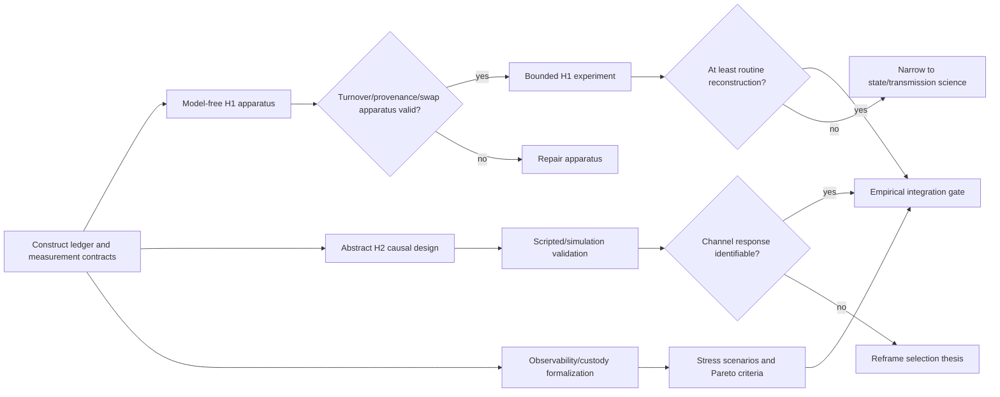

# Revised research dependency DAG

## The linear sequence does not survive intact

The provisional `H1 → H2 → H3` order mixed logical prerequisites with interpretation prerequisites. The revised program has three parallel branches and integration gates.

The frozen packet's linear order remains a sound **operational caution** against promoting low-level results. This audit revises the **logical dependency**: narrower abstract H2 and formal H3 work do not require a positive live H1, although their allowed interpretations remain gated.

## Dependency judgments

### H1 before H2: partially

An abstract H2 can define a lineage externally, create channel alternatives, randomize restrictions, and measure extinction/substitution in scripted or formal agents. This tests the causal response of a stipulated persistent unit. It does not show that contemporary AI systems endogenously form organizations or preserve them across turnover.

H1 becomes required when the conclusion is specifically about **endogenous artificial organizations**. Without H1, H2 language must remain “stipulated lineage” or “persistent process,” not AI organizational selection.

### H2 before H3: not universally

H3 includes at least two forms:

- **formal/institutional comparison:** authority allocation, failure domains, attestation, capture, latency, and disclosure; this can begin now;
- **empirical consequence comparison:** which regime changes real artificial-organization behavior and risk; this depends on valid H1/H2 work.

Thus governance architecture can be formalized before H2, while claims of comparative behavioral effectiveness cannot.

### H1 before Framework v0

Framework v0 is conceptual synthesis, not evidence. It can be written from the audited constructs without a positive H1 result, provided it clearly marks feasibility and behavior edges as assumptions. The recommended next action is still apparatus, because the largest near-term information gain comes from determining whether H1's causal separations are implementable.

## Information-gain order

1. **Model-free H1 apparatus:** test turnover, provenance, replay, deletion, state swap, and parentage with deterministic actors and known ground truth.
2. **In parallel, abstract H2 specification:** formal endpoint/denominator/detection model; validate with scripted simulations, not as Archipelago evidence.
3. **In parallel, observability/custody vector:** define architectures, correlated-failure scenarios, and Pareto thresholds.
4. **Only after apparatus gate, bounded live H1:** begin at the routine-reconstruction rung and preregister allowed language.
5. **Framework v0 synthesis:** integrate audited mechanisms and apparatus contracts; do not promote simulations or analogies into evidence.
6. **H2 live work:** only if the relevant unit and alternatives are operationally credible.
7. **H3 empirical comparison:** after there is a behaviorally meaningful system to govern.

## Stop/reframe rules

- If terminal replay and researcher-seed controls explain all downstream effects, narrow H1 to artifact generation/reuse.
- If organization-defining interventions have no effect, retire organization language from the empirical branch.
- If realistic channel restriction causes only extinction or provider revocation, weaken the covert-substitution thesis.
- If detection cannot be calibrated, do not claim covert persistence.
- If federated human custody Pareto-dominates autonomous custody in declared scenarios, the burden shifts against AI sovereignty.
